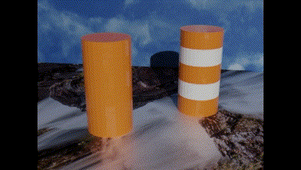
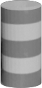
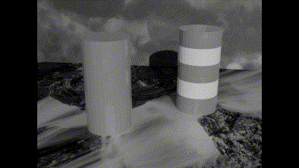
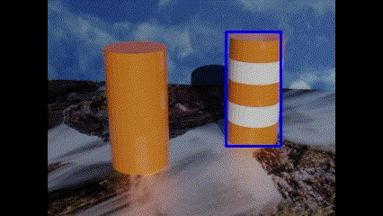

# Object Detection using Masks

## Table of Contents
- [Object Detection using Masks](#object-detection-using-masks)
  - [Table of Contents](#table-of-contents)
  - [Project Summary](#project-summary)
  - [Skills](#skills)
  - [Images](#images)
  - [Contacts](#contacts)

## Project Summary
Have you ever wondered how drones scan their environment and detect objects on their own? Drones need to be exposed to potential hazards so that they can detect those hazards again in the future. Creating a "Mask" of the a hazard is one way that a drone can learn to recognize an object. The mask serves as a reference to the original 

## Skills
- Python
  - Numpy
  - OpenCV
- Creating Masks for Object Detection
- Thresholding Video Frames

## Images

Input Source:

Mask of Object We want to Detect:

Input Video Converted to Grayscale

Final Video Product

## Contacts
Naaman Trumbull
trumbull@terpmail.umd.edu
[LinkedIn](https://www.linkedin.com/in/naamantrumbull/)
[Careers4Terps](https://umd-csm.symplicity.com/profiles/naamantrumbull)
[Github](https://github.com/naatrumbull)
